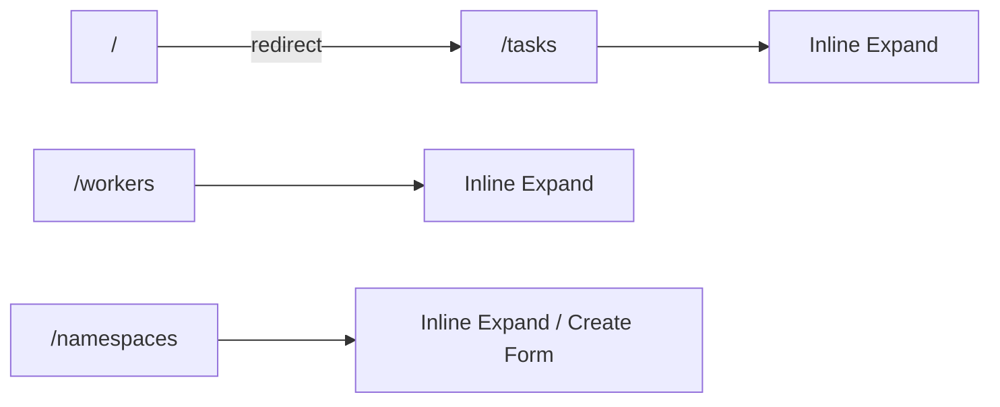
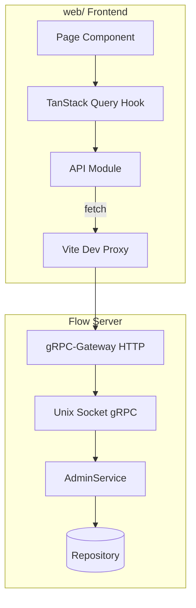

# Flow Admin Dashboard Design

> Date: 2026-07-12
> Status: approved

## Overview

为 Flow 分布式任务队列构建现代风格 Web 管理后台。基于 `api/admin/v1` AdminService HTTP 接口，面向平台运维人员，以任务监控为核心工作流。

## Key Decisions

| Decision | Choice | Rationale |
|----------|--------|-----------|
| Layout | 图标侧栏 + 列表页 + 右侧抽屉 | 任务监控优先，打开即见队列；避免子页面碎片化 |
| Default route | `/` → redirect `/tasks` | 根路径语义清晰，任务列表为默认落地 |
| Detail pattern | Inline row expansion（行内手风琴展开） | 用户反馈 Drawer 不美观；全宽展示详情，无浮层 |
| Visual style | Linear-inspired + shadcn/ui | 用户指定；克制、精准、现代工具感 |
| Theme | System + manual toggle | 双主题平等，深色/浅色均完整支持 |
| Tech stack | React + Vite + TS + shadcn + TanStack Query | 用户指定；生态成熟，适合数据密集型后台 |
| State refresh | 任务列表 5s 自动轮询 | 运维场景需要近实时状态 |

---

## 1. Information Architecture

### 1.1 App Shell

```
┌──────┬──────────────────────────────────────────┐
│ Icon │  Topbar: breadcrumb · ⌘K search · theme  │
│ Side ├──────────────────────────────────────────┤
│ Bar  │                                          │
│      │  Page Content (list + filters)          │
│      │  ┌────────────────────────────────────┐  │
│      │  │ Table row                          │  │
│      │  ├────────────────────────────────────┤  │
│      │  │ ▼ Inline expanded detail panel     │  │
│      │  └────────────────────────────────────┘  │
│      │  │ Table row                          │  │
└──────┴──────────────────────────────────────────┘
```

- **Icon Sidebar**（56px）：Tasks · Workers · Namespaces · Settings
- **Topbar**：当前页面标题、全局搜索（⌘K Command palette）、主题切换按钮
- **Content**：列表 + 筛选器
- **Inline Detail**：点击行在表格内向下展开详情区域（手风琴，同时仅一行展开）

### 1.2 Routes

| Route | Page | Description |
|-------|------|-------------|
| `/` | Redirect | 302 → `/tasks` |
| `/tasks` | TasksPage | 任务列表 + 状态 Tab + 筛选 + 行内展开详情 |
| `/workers` | WorkersPage | Worker 列表 + 行内展开详情 |
| `/namespaces` | NamespacesPage | Namespace 列表 + 行内展开编辑 |
| `/settings` | SettingsPage | Admin API 基址配置 |

无 `/tasks/:id`、`/workers/:id`、`/namespaces/:name` 等子路由。

### 1.3 Navigation Flow



---

## 2. Page Specifications

### 2.1 Tasks Page (`/tasks`)

**Primary view for platform ops.**

#### List

| Column | Source | Notes |
|--------|--------|-------|
| Status | `Task.state` | 色点 + Badge：INITED 灰 · RUNNING 琥珀 · DONE 绿 · FAILED 红 · CANCELLED 灰 |
| ID | `Task.id` | 截断显示，mono 字体，hover 显示完整 |
| Namespace | `Task.namespace` | |
| Task Type | `Task.task_type` | |
| Updated | `Task.update_time` | 相对时间（"2m ago"） |
| Actions | — | Cancel（INITED/RUNNING）、Delete（确认 Dialog） |

#### Filters

- **Status Tabs**：All / Running / Failed / Done / Cancelled（映射 `TaskState` enum）
- **Namespace**：下拉选择（从 ListNamespaces 获取）
- **Task Type**：文本输入筛选

#### Pagination

Offset-based：`page` + `page_size`（max 100），底部分页器显示 total_count。

#### Inline Detail Panel

触发：点击表格行，在该行下方展开详情区域（手风琴，同时仅一行展开；再次点击收起）。

展开区域内容：
1. **Header**：状态 Badge + 完整 ID + 操作按钮（Cancel / Delete）
2. **Metadata**：namespace、task_type、attempt_no、worker_id、max_retry、next_run_time、create/update/heartbeat 时间
3. **Payload / Result / Error**：bytes 字段 base64 解码，JSON 则格式化展示，否则 hex/raw
4. **Events Timeline**：`ListTaskEvents` 分页列表，event_type + create_time + payload 摘要

展开区域背景略深于表格行（`--muted` tint），上下 border 分隔，内 padding 16px。

#### Auto-refresh

TanStack Query `refetchInterval: 5000` on task list. 展开行打开时同步刷新当前 task。

### 2.2 Workers Page (`/workers`)

#### List

| Column | Source |
|--------|--------|
| ID | `Worker.id` |
| Name | `Worker.name` |
| Namespace | `Worker.namespace` |
| Task Type | `Worker.task_type` |
| Heartbeat | `Worker.heartbeat_time` | 相对时间 + 离线判定（>30s 标红） |
| Stats | `success_dealt` / `total_dealt` |

#### Filters

- Namespace 下拉
- Task Type 文本输入

#### Auto-refresh

TanStack Query `refetchInterval: 5000` on task list. 展开行打开时同步刷新当前 task。

#### Inline Detail Panel

点击行展开：完整元数据、心跳时间线、处理统计。同时仅一行展开。

### 2.3 Namespaces Page (`/namespaces`)

#### List

| Column | Source |
|--------|--------|
| Name | `Namespace.name` |
| Description | `Namespace.description` |
| Creator | `Namespace.creator` |
| API Key | `Namespace.api_key_preview` | 遮罩显示 |
| Created | `Namespace.create_time` |

#### Actions

- **Create**：顶部按钮 → 表格顶部插入创建表单行（inline form）→ `CreateNamespace`
- **Edit**：点击行 → 行内展开编辑表单（description/creator）→ `UpdateNamespace`
- **API Key**：展开区域展示 `api_key_preview`，创建后一次性展示完整 `api_key`（带复制按钮）

Namespace 不可删除（API 不支持）。

### 2.4 Settings Page (`/settings`)

- Admin API Base URL 配置（默认 `http://localhost:{port}`）
- 存储在 localStorage
- 连接测试按钮（GET `/api/admin/v1/namespaces?page=1&page_size=1`）

---

## 3. Visual System

### 3.1 Color Strategy

**Restrained** — tinted neutrals + one accent ≤10%.

| Token | Dark | Light | Usage |
|-------|------|-------|-------|
| `--background` | `oklch(0.13 0.005 260)` | `oklch(0.98 0.003 260)` | 页面底 |
| `--sidebar` | `oklch(0.11 0.005 260)` | `oklch(0.96 0.004 260)` | 侧栏 |
| `--foreground` | `oklch(0.93 0.005 260)` | `oklch(0.15 0.01 260)` | 正文 |
| `--primary` | `oklch(0.55 0.18 265)` | `oklch(0.50 0.18 265)` | 主操作/选中 |
| `--muted-foreground` | `oklch(0.60 0.01 260)` | `oklch(0.45 0.01 260)` | 次要文字 |
| `--destructive` | `oklch(0.55 0.2 25)` | `oklch(0.50 0.2 25)` | 删除/失败 |
| `--warning` | `oklch(0.75 0.15 75)` | `oklch(0.65 0.15 75)` | Running |
| `--success` | `oklch(0.65 0.17 145)` | `oklch(0.55 0.17 145)` | Done |

### 3.2 Typography

- **Sans**：Inter（UI 全局）
- **Mono**：JetBrains Mono（ID、bytes、timestamp）
- **Scale**（固定 rem）：12 / 13 / 14 / 16 / 20 / 24 px
- 表格正文 13px，表头 12px uppercase tracking

### 3.3 Spacing & Layout

- Sidebar width: 56px (icon-only)
- Content padding: 24px
- Table row height: 40px
- Border radius: 6px (shadcn default)
- Inline expand panel: full table width, min-height 120px

### 3.4 Motion

- Transitions: 150–200ms, ease-out
- Row expand/collapse (200ms height), tab underline, toast enter
- `@media (prefers-reduced-motion: reduce)`: transition-duration 0ms

### 3.5 shadcn Components

| Component | Usage |
|-----------|-------|
| `Table` / custom DataTable | 三个列表页 |
| `Collapsible` / custom expand row | 行内展开详情 |
| `Tabs` | 任务状态筛选 |
| `Badge` | 状态标签 |
| `Button` | 操作 |
| `Dialog` | 删除确认 |
| `Command` | ⌘K 全局搜索/跳转 |
| `Select` / `Input` | 筛选器、表单 |
| `Sonner` | Toast 反馈 |
| `DropdownMenu` | 行操作菜单 |
| `Skeleton` | 加载态 |

---

## 4. Technical Architecture

### 4.1 Directory Structure

```
web/
├── index.html
├── package.json
├── vite.config.ts
├── tsconfig.json
├── tailwind.config.ts
├── components.json          # shadcn config
├── src/
│   ├── main.tsx
│   ├── App.tsx              # Router + AppShell
│   ├── api/
│   │   ├── client.ts        # fetch wrapper + base URL
│   │   ├── types.ts         # TS types from proto schemas
│   │   ├── namespaces.ts
│   │   ├── tasks.ts
│   │   └── workers.ts
│   ├── components/
│   │   ├── ui/              # shadcn primitives
│   │   ├── layout/
│   │   │   ├── app-shell.tsx
│   │   │   ├── sidebar.tsx
│   │   │   └── topbar.tsx
│   │   └── domain/
│   │       ├── task-table.tsx
│   │       ├── task-expand-panel.tsx
│   │       ├── worker-table.tsx
│   │       ├── worker-expand-panel.tsx
│   │       ├── namespace-table.tsx
│   │       └── namespace-expand-panel.tsx
│   ├── hooks/
│   │   ├── use-tasks.ts
│   │   ├── use-workers.ts
│   │   └── use-namespaces.ts
│   ├── pages/
│   │   ├── tasks-page.tsx
│   │   ├── workers-page.tsx
│   │   ├── namespaces-page.tsx
│   │   └── settings-page.tsx
│   └── lib/
│       ├── utils.ts
│       ├── format.ts        # time, bytes, state helpers
│       └── constants.ts     # TaskState mapping
```

### 4.2 API Client

REST endpoints (from `api/admin/v1/rpc.proto`):

| Method | Path | Used by |
|--------|------|---------|
| GET | `/api/admin/v1/namespaces` | Namespaces list |
| POST | `/api/admin/v1/namespaces` | Create namespace |
| GET | `/api/admin/v1/namespaces/{name}` | Namespace 展开详情 |
| PUT | `/api/admin/v1/namespaces/{name}` | Update namespace |
| GET | `/api/admin/v1/tasks` | Tasks list |
| GET | `/api/admin/v1/tasks/{id}` | Task 展开详情 |
| POST | `/api/admin/v1/tasks/{id}/cancel` | Cancel task |
| DELETE | `/api/admin/v1/tasks/{id}` | Delete task |
| GET | `/api/admin/v1/tasks/{task_id}/events` | Task events |
| GET | `/api/admin/v1/workers` | Workers list |
| GET | `/api/admin/v1/workers/{id}` | Worker 展开详情 |

### 4.3 Dev Proxy

```typescript
// vite.config.ts
server: {
  proxy: {
    '/api/admin': {
      target: 'http://localhost:8080', // configurable
      changeOrigin: true,
    },
  },
}
```

### 4.4 Data Flow



### 4.5 Key Dependencies

- `react`, `react-dom`, `react-router-dom`
- `@tanstack/react-query`
- `tailwindcss`, `@tailwindcss/vite`
- shadcn/ui components (radix primitives)
- `lucide-react` (icons)
- `sonner` (toasts)
- `cmdk` (command palette)

---

## 5. Error Handling

| Scenario | UX |
|----------|-----|
| API 网络错误 | Toast "无法连接 Admin API" + Settings 页引导 |
| 404 Not Found | 展开区域内空状态 |
| Cancel 状态不允许 | Toast 显示服务端错误信息 |
| Delete 确认 | Dialog 二次确认，显示 task ID |
| 空列表 | 空状态文案 + 引导（Namespaces: "创建第一个 namespace"） |
| 加载中 | Table skeleton rows |

---

## 6. Out of Scope (v1)

- 用户认证/登录（Admin API 当前无 auth）
- 图表/仪表盘首页
- Worker 管理操作（API 仅只读）
- Namespace 删除
- 实时 WebSocket 推送（用轮询代替）
- i18n

---

## 7. Self-Review Checklist

- [x] No TBD/TODO placeholders
- [x] Routes consistent with user feedback (no sub-pages, `/` redirects)
- [x] All 11 Admin API endpoints mapped to UI
- [x] Visual system aligned with Linear + shadcn decisions
- [x] Scope bounded for single implementation plan
